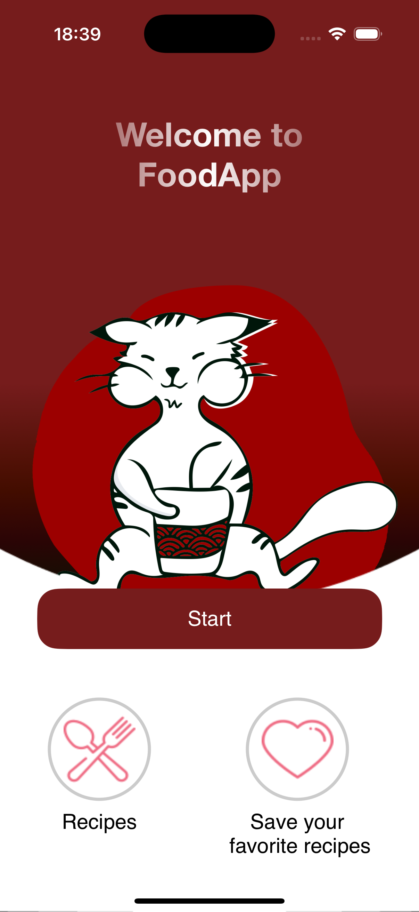
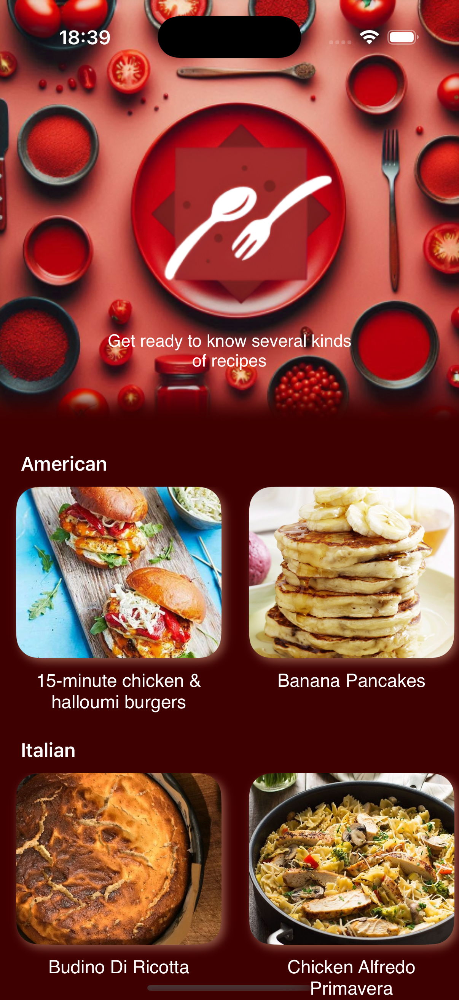
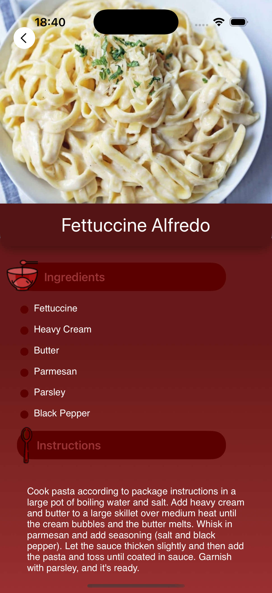

# RecipeApp-iOS

**RecipeApp** is a personal project I created to make cooking more accessible and fun. The app features a WelcomeScreen, HomeScreen, and DetailsScreen, each designed with a clean and engaging interface. Using the TheMealDB API, RecipeApp offers a variety of recipes from different cuisines, complete with detailed instructions and ingredient lists. The app is perfect for anyone looking to discover new dishes or improve their cooking skills. Whether you're exploring American pancakes or Italian pasta, RecipeApp makes it easy to find and follow delicious recipes.

---

## Screenshots

| Welcome Screen                          | Gameplay Screen                           | Result Screen                           |
|-----------------------------------------|-------------------------------------------|-----------------------------------------|
|  |  |  |

## Technologies Used

- **Swift**: Implemented for handling the core logic and managing game functionality.
- **SwiftUI**: Utilized to design the app's user interface with a declarative approach.
- **MVVM Architecture**: Ensures a clear separation between the UI (View) and business logic (ViewModel).
- **TheMealDB API**: Provides a comprehensive database of recipes and meal details.
- **Xcode**: The primary IDE used for development and testing the application.

---
